# DocumentAI-Prep Project Architecture Diagram

## 🔄 Complete Pipeline Flow Diagram

```mermaid

flowchart TD
%% Input Layer
A[📄 Input Documents<br/>data/] --> B{📋 File Types}
B --> B1[📄 PDF Files]
B --> B2[📄 DOCX Files]
B --> B3[📄 PPTX Files]

    %% Step 1: Inspection
    B1 --> C[🔍 Step 1: File Inspection<br/>inspection_agent.py]
    B2 --> C
    B3 --> C
    C --> C1[📊 Metadata Validation<br/>output/step1-metadata_data.json]

    %% Step 2: OCR
    C1 --> D[🔤 Step 2: Text Extraction<br/>OCR_Extractor.py]
    D --> D1[📝 Plain Text Files<br/>output/ocr_output/]

    %% Step 3: Chunking
    D1 --> E[✂️ Step 3: Text Chunking<br/>split_text_chunks.py]
    E --> E1{🧠 Embedding Type}
    E1 --> E2[🤖 Sentence Transformer<br/>Local Processing]
    E1 --> E3[🌐 Ollama<br/>GPU Accelerated]
    E2 --> F[📦 Chunked Text + Embeddings<br/>output/chunked_output/]
    E3 --> F

    %% Step 4: QA Generation
    F --> G[❓ Step 4: QA Generation<br/>generate_qa.py]
    G --> G1{🎮 GPU Check}
    G1 --> G2[🚀 GPU Available<br/>Fast Processing]
    G1 --> G3[🐌 CPU Fallback<br/>Slower Processing]
    G2 --> H[💬 Q&A Pairs<br/>output/qa_pairs/]
    G3 --> H

    %% Step 5: Cleaning
    H --> I[🧹 Step 5: Output Cleaning<br/>remove_metadata_fromjson.py]
    I --> J[✨ Clean Training Data<br/>output/cleaned_json_output/]

    %% Final Output
    J --> K[🎯 Final Output<br/>Training-Ready Dataset]

    %% Styling
    classDef inputFiles fill:#cce5ff,stroke:#0066cc,stroke-width:3px,color:#000000
    classDef processing fill:#e6ccff,stroke:#6600cc,stroke-width:3px,color:#000000
    classDef output fill:#ccffcc,stroke:#009900,stroke-width:3px,color:#000000
    classDef decision fill:#ffffcc,stroke:#cc9900,stroke-width:3px,color:#000000
    classDef final fill:#ffcccc,stroke:#cc0000,stroke-width:4px,color:#000000

    class A,B,B1,B2,B3 inputFiles
    class C,D,E,G,I processing
    class C1,D1,F,H,J output
    class B,E1,G1 decision
    class K final

```

## 🏗️ System Architecture Diagram

```mermaid
graph TB
    subgraph "🖥️ System Environment"
        subgraph "🐍 Python Environment"
            ENV[data_prep_venv/<br/>Virtual Environment]
            REQ[requirements.txt<br/>Dependencies]
        end

        subgraph "⚙️ Configuration"
            CONF[.env File<br/>Settings & GPU Config]
            BAT[🔧 Batch Scripts<br/>setup_data_prep.bat<br/>start_data_prep.bat]
        end

        subgraph "🎮 Hardware Layer"
            GPU[🎮 NVIDIA GPU<br/>CUDA Acceleration]
            CPU[💻 CPU<br/>Fallback Processing]
            MEM[🧠 RAM<br/>8GB+ Required]
        end
    end

    subgraph "📁 Data Layer"
        INPUT[📂 data/<br/>Source Documents]
        OUTPUT[📂 output/<br/>Processed Results]
        MODELS[🤖 models/<br/>AI Models Cache]

        subgraph "📊 Output Structure"
            OUT1[📋 step1-metadata_data.json]
            OUT2[📝 ocr_output/]
            OUT3[📦 chunked_output/]
            OUT4[💬 qa_pairs/]
            OUT5[✨ cleaned_json_output/]
        end
    end

    subgraph "🔧 Processing Layer"
        MAIN[🚀 main.py<br/>Pipeline Controller]

        subgraph "📝 Core Modules"
            INSP[🔍 inspection_agent.py]
            OCR[🔤 OCR_Extractor.py]
            CHUNK[✂️ split_text_chunks.py]
            QA[❓ generate_qa.py]
            CLEAN[🧹 remove_metadata_fromjson.py]
        end

        subgraph "🛠️ Utility Modules"
            FIX[🔧 fix_ollama_gpu.py]
            TEST[🧪 test_ollama_connection.py]
            TESTGPU[🎮 test_gpu_selection.py]
        end
    end

    subgraph "🤖 AI Services"
        OLLAMA[🦙 Ollama<br/>Local LLM Server]
        SENT[🧠 Sentence Transformers<br/>Embedding Models]
        TESSERACT[👁️ Tesseract OCR<br/>Text Recognition]
    end

    %% Connections
    CONF --> MAIN
    ENV --> MAIN
    INPUT --> MAIN
    MAIN --> INSP
    MAIN --> OCR
    MAIN --> CHUNK
    MAIN --> QA
    MAIN --> CLEAN

    INSP --> OUT1
    OCR --> OUT2
    CHUNK --> OUT3
    QA --> OUT4
    CLEAN --> OUT5

    OCR --> TESSERACT
    CHUNK --> SENT
    QA --> OLLAMA

    GPU --> OLLAMA
    CPU --> OLLAMA
    GPU --> SENT

    FIX --> OLLAMA
    TEST --> OLLAMA
    TESTGPU --> GPU

    %% Styling
    classDef environment fill:#e6f3ff,stroke:#0066cc,stroke-width:3px,color:#000000
    classDef data fill:#e6ffe6,stroke:#009900,stroke-width:3px,color:#000000
    classDef processing fill:#ffe6f3,stroke:#cc0066,stroke-width:3px,color:#000000
    classDef ai fill:#fff3e6,stroke:#ff6600,stroke-width:3px,color:#000000
    classDef hardware fill:#f3e6ff,stroke:#6600cc,stroke-width:3px,color:#000000

    class ENV,REQ,CONF,BAT environment
    class INPUT,OUTPUT,MODELS,OUT1,OUT2,OUT3,OUT4,OUT5 data
    class MAIN,INSP,OCR,CHUNK,QA,CLEAN,FIX,TEST,TESTGPU processing
    class OLLAMA,SENT,TESSERACT ai
    class GPU,CPU,MEM hardware
```

<a href="https://mermaid.live/edit#pako:eNp1VE1PwzAM_StRzgVa2qVft-0ykABpEhOaxLhNHEySOnPILGPJxtDe_Unn0sKEYHezn_2e_ZydUE7JQJJa8Q2EBpaCZIFWtWaBo7W33WwUakvE0QRhQCggBTz8-MHErMikYYJQ4LOBYTMDYTs_AOOJXORlWc5lMlu4d7CJtaPfN-QCkdxBoyVm1pb2kcA62h0hhsX_DWojnB0TyivhWi4glJo15ZdXwuhbWh80OIpy8y5UKMCkoHJIlEqkK7wjmjlMlOE5NlmCdk6Yp4trG8n76F1EmfFKbT8YLIhByYQ6Nl4VBKszr21lFtfeotidWZPK2AhV31XGXIhSiD8hpso0qpqYcW1X0MlhTImSBoUXiAAkalvvfWZcyCbxoGiSZVsjCRlfypJilpEauGM6SlRSb0AIQbb105Xuru5g38UrkQbR5e31zW0649c3F_fJbXJ9aw_olNMa6EZ_KkBgE4xfy5eUPfoD0Hsx7cNpu1BqRpidKNJVWxvc3Aht6Xds7Xcs3lQ-_qHd-0GTA" target="_blank">
  
</a>

## 📊 Data Flow & File Structure

<a href="https://mermaid.live/edit#pako:eNp1Uk1PwzAM_StRzgVa2qVft-0ykABpEhOaxLhNHEySOnPILGPJxtDe_Unn0sKEYHezn_2e_ZydUE7JQJJa8Q2EBpaCZIFWtWaBo7W33WwUakvE0QRhQCggBTz8-MHErMikYYJQ4LOBYTMDYTs_AOOJXORlWc5lMlu4d7CJtaPfN-QCkdxBoyVm1pb2kcA62h0hhsX_DWojnB0TyivhWi4glJo15ZdXwuhbWh80OIpy8y5UKMCkoHJIlEqkK7wjmjlMlOE5NlmCdk6Yp4trG8n76F1EmfFKbT8YLIhByYQ6Nl4VBKszr21lFtfeotidWZPK2AhV31XGXIhSiD8hpso0qpqYcW1X0MlhTImSBoUXiAAkalvvfWZcyCbxoGiSZVsjCRlfypJilpEauGM6SlRSb0AIQbb105Xuru5g38UrkQbR5e31zW0649c3F_fJbXJ9aw_olNMa6EZ_KkBgE4xfy5eUPfoD0Hsx7cNpu1BqRpidKNJVWxvc3Aht6Xds7Xcs3lQ-_qHd-0GTA" target="_blank">
  
</a>

## 🚀 Execution Flow Diagram

```mermaid
sequenceDiagram
    participant User
    participant Setup as setup_data_prep.bat
    participant Main as start_data_prep.bat
    participant Pipeline as main.py
    participant GPU as GPU Check
    participant Steps as Processing Steps
    participant Output as Output Files

    User->>Setup: 🔧 First-time setup
    Setup->>Setup: Install dependencies
    Setup->>Setup: Configure environment
    Setup-->>User: ✅ Setup complete

    User->>Main: 🚀 Run pipeline
    Main->>Pipeline: Execute main.py

    Pipeline->>GPU: 🎮 Check GPU status
    GPU-->>Pipeline: GPU available/CPU fallback

    Pipeline->>Steps: Step 1: File Inspection
    Steps-->>Output: metadata_data.json

    Pipeline->>Steps: Step 2: OCR Extraction
    Steps-->>Output: Text files

    Pipeline->>Steps: Step 3: Text Chunking
    Steps-->>Output: Embedded chunks

    Pipeline->>Steps: Step 4: QA Generation
    Steps-->>Output: Q&A pairs

    Pipeline->>Steps: Step 5: Cleaning
    Steps-->>Output: Clean dataset

    Pipeline-->>User: ✅ Pipeline complete
```

<a href="https://mermaid.live/view#pako:eNp1UkFOwzAQ_MrKcwGTpE3zpH0CElJLlZAqcRs_eJ2Na8WreMPQ9vWsk4CKCr3Znd2ZnRmfnExSd0gGUk0k20CoYSlYEWvVJRuwtLY5bTRqS8TJGGFAKCAFPPz4wcSsyKRhglDgs4FhMwNhOz8A44k8qP3Rfuzrr_M7zk9Q9QvkApHcQaMlZtaW9pHAOtodIYbF_w1qI5wdE8or4VouIJSaNeWXV8LoW1ofNDiKcvMuVCjApKBySJRKpCu8I5o5TJThOTZZgnZOmKeLaxvJ--hdRJnxSm0_GCyIQcmEOjZeFQSrM69tZRbX3qLYnVmTytgIVd9VxlyIUog_IabKNKqamHFtV9DJYUyJkgaFF4gAJGpb731mXMgm8aBokmeWRhIyvpQlxSwjNXDHdJSopN6AEIJS66cr3V3dwb6LVyINosvb65vbdMavby7uk9vk-tYe0CmnNdCN_lSAwCYYv5YvKXv0B6D3YtqH03ah1IwwO1Gkq7Y2uLkR2tLv2NrvWLypfPxDu_eDJg" target="_blank">
  
</a>

## 🔧 Tool Dependencies

```mermaid
mindmap
  root((DocumentAI-Prep))
    🐍 Python Core
      📦 Dependencies
        🔤 pdfplumber
        📝 python-docx
        📊 python-pptx
        👁️ pytesseract
        🧠 sentence-transformers
        🌐 requests
        📋 pandas
        🔧 python-dotenv
    🤖 AI Services
      🦙 Ollama
        🎯 Mistral Model
        🎮 GPU Acceleration
      🧠 Sentence Transformers
        📊 all-MiniLM-L6-v2
        🔍 multi-qa-MiniLM-L6-cos-v1
      👁️ Tesseract OCR
        🖼️ Image Processing
        📝 Text Recognition
    🖥️ System Tools
      🎮 NVIDIA Drivers
      🔧 CUDA Toolkit
      📊 nvidia-smi
      🐚 PowerShell
```

<a href="https://mermaid.live/view#pako:eNp1UkFOwzAQ_MrKcwGTpE3zpH0CElJLlZAqcRs_eJ2Na8WreMPQ9vWsk4CKCr3Znd2ZnRmfnExSd0gGUk0k20CoYSlYEWvVJRuwtLY5bTRqS8TJGGFAKCAFPPz4wcSsyKRhglDgs4FhMwNhOz8A44k8qP3Rfuzrr_M7zk9Q9QvkApHcQaMlZtaW9pHAOtodIYbF_w1qI5wdE8or4VouIJSaNeWXV8LoW1ofNDiKcvMuVCjApKBySJRKpCu8I5o5TJThOTZZgnZOmKeLaxvJ--hdRJnxSm0_GCyIQcmEOjZeFQSrM69tZRbX3qLYnVmTytgIVd9VxlyIUog_IabKNKqamHFtV9DJYUyJkgaFF4gAJGpb731mXMgm8aBokmeWRhIyvpQlxSwjNXDHdJSopN6AEIJS66cr3V3dwb6LVyINosvb65vbdMavby7uk9vk-tYe0CmnNdCN_lSAwCYYv5YvKXv0B6D3YtqH03ah1IwwO1Gkq7Y2uLkR2tLv2NrvWLypfPxDu_eDJg" target="_blank">
  
</a>

## 📈 Performance Optimization Flow

```mermaid
flowchart TD
    START[🚀 Pipeline Start] --> GPU_CHECK{🎮 GPU Available?}

    GPU_CHECK -->|Yes| GPU_PATH[🚀 GPU Accelerated Path]
    GPU_CHECK -->|No| CPU_PATH[🐌 CPU Fallback Path]

    GPU_PATH --> GPU_OCR[⚡ Fast OCR Processing]
    GPU_PATH --> GPU_EMBED[⚡ GPU Embeddings]
    GPU_PATH --> GPU_QA[⚡ GPU QA Generation]

    CPU_PATH --> CPU_OCR[🐌 Standard OCR]
    CPU_PATH --> CPU_EMBED[🐌 CPU Embeddings]
    CPU_PATH --> CPU_QA[🐌 CPU QA Generation]

    GPU_OCR --> BATCH_PROC[📊 Batch Processing]
    CPU_OCR --> BATCH_PROC

    GPU_EMBED --> PARALLEL[⚡ Parallel Processing]
    CPU_EMBED --> SERIAL[🔄 Serial Processing]

    GPU_QA --> FAST_COMPLETE[✅ Fast Completion]
    CPU_QA --> SLOW_COMPLETE[✅ Slow Completion]

    BATCH_PROC --> MONITOR[📊 Progress Monitoring]
    PARALLEL --> MONITOR
    SERIAL --> MONITOR

    MONITOR --> FAST_COMPLETE
    MONITOR --> SLOW_COMPLETE

    FAST_COMPLETE --> RESULTS[🎯 Final Results]
    SLOW_COMPLETE --> RESULTS

    %% Styling
    classDef gpu fill:#ccffcc,stroke:#009900,stroke-width:3px,color:#000000
    classDef cpu fill:#ffcccc,stroke:#cc0000,stroke-width:3px,color:#000000
    classDef process fill:#e6ccff,stroke:#6600cc,stroke-width:3px,color:#000000
    classDef result fill:#ffffcc,stroke:#cc9900,stroke-width:4px,color:#000000

    class GPU_PATH,GPU_OCR,GPU_EMBED,GPU_QA,PARALLEL,FAST_COMPLETE gpu
    class CPU_PATH,CPU_OCR,CPU_EMBED,CPU_QA,SERIAL,SLOW_COMPLETE cpu
    class BATCH_PROC,MONITOR process
    class RESULTS result
```

<a href="https://mermaid.live/view#pako:eNp1UkFOwzAQ_MrKcwGTpE3zpH0CElJLlZAqcRs_eJ2Na8WreMPQ9vWsk4CKCr3Znd2ZnRmfnExSd0gGUk0k20CoYSlYEWvVJRuwtLY5bTRqS8TJGGFAKCAFPPz4wcSsyKRhglDgs4FhMwNhOz8A44k8qP3Rfuzrr_M7zk9Q9QvkApHcQaMlZtaW9pHAOtodIYbF_w1qI5wdE8or4VouIJSaNeWXV8LoW1ofNDiKcvMuVCjApKBySJRKpCu8I5o5TJThOTZZgnZOmKeLaxvJ--hdRJnxSm0_GCyIQcmEOjZeFQSrM69tZRbX3qLYnVmTytgIVd9VxlyIUog_IabKNKqamHFtV9DJYUyJkgaFF4gAJGpb731mXMgm8aBokmeWRhIyvpQlxSwjNXDHdJSopN6AEIJS66cr3V3dwb6LVyINosvb65vbdMavby7uk9vk-tYe0CmnNdCN_lSAwCYYv5YvKXv0B6D3YtqH03ah1IwwO1Gkq7Y2uLkR2tLv2NrvWLypfPxDu_eDJg" target="_blank">
  
</a>

## 📝 Quick Reference

> **💡 Tip**: Click the **📥 Download** buttons above each diagram to open Mermaid Live Editor in a new tab! From there you can export high-quality PNG, SVG, or PDF images for presentations, documentation, or offline viewing. You can also edit the diagrams directly in the browser.

### 🚀 Running the Pipeline

1. **Setup**: `setup_data_prep.bat` (one-time)
2. **Execute**: `start_data_prep.bat` (main pipeline)
3. **Monitor**: Check console output for progress
4. **Results**: Find outputs in `output/` folder

### 🔧 Troubleshooting Tools

- `fix_ollama_gpu.py` - Fix GPU issues
- `test_ollama_connection.py` - Test AI model
- `test_gpu_selection.py` - GPU diagnostics

### 📁 Key Directories

- `data/` - Input documents
- `output/` - All processed results
- `models/` - Cached AI models
- `docs/` - Documentation

### ⚙️ Configuration

Edit `.env` file to customize:

- AI models and settings
- GPU configuration
- Processing parameters
- Batch sizes and performance tuning
